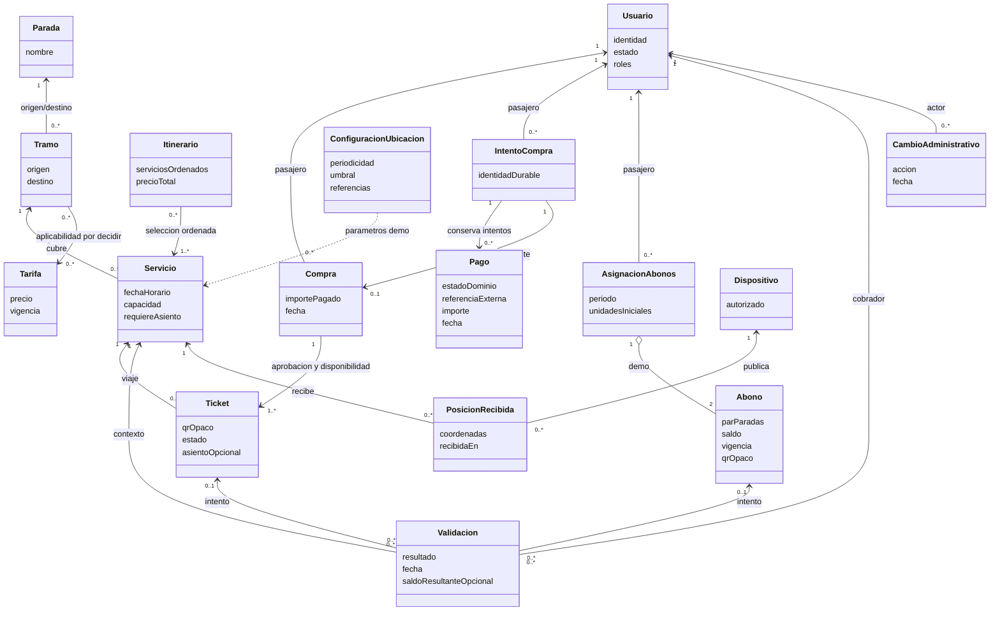
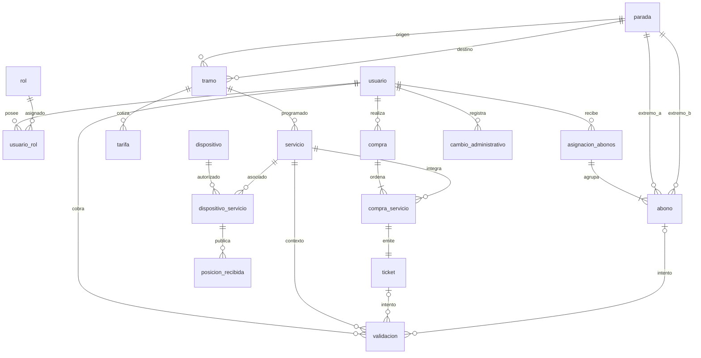

# Obligatorio Berruti — Borrador de modelado de datos del MVP

**Estado: propuesta para revisión de Enzo, no esquema aprobado.** Primero se representan conceptos y reglas del dominio en UML; luego una posible persistencia MySQL en ER. Las cardinalidades y restricciones marcadas **propuesta** no autorizan por sí solas políticas comerciales. Fuentes: [MVP](../mvp.md), [requisitos](../requerimientos.md), [historias](../user-stories.md) y [backlog](../tasks.json). No se encontró consigna oficial; contrastar este borrador con ella antes de implementar.

## 1. Dominio (UML)

Un itinerario es una selección ordenada de servicios, no necesariamente una entidad durable. Un tramo representa el par de paradas de un segmento; el «orden dentro de una ruta» del inventario preliminar del MVP §8 es provisional: la pertenencia y el orden en una ruta requieren definición posterior. La instancia fechada que se valida es el servicio. El abono habilita un par de paradas en ambos sentidos (RN-13), no necesariamente una única dirección de servicio.

Las asociaciones del diagrama expresan intención conceptual, no un esquema físico aprobado: un servicio puede aparecer en múltiples selecciones de itinerario; cada selección contiene uno o más servicios ordenados. Cada ticket emitido pertenece a exactamente una compra confirmada; la generación de todos los tickets ocurre junto con ella. El intento durable de compra agrupa y conserva los intentos de pago, aunque no llegue a existir compra confirmada. El acuerdo conceptual del usuario admite a lo sumo una compra confirmada por intento durable; no define su representación física ni la retención temporal de los registros. Cada validación resuelta refiere **exactamente un** ticket o abono si el QR existe; un QR desconocido no refiere ninguno. Un ticket admite muchos intentos, pero a lo sumo uno exitoso.

## 2. Persistencia candidata (ER MySQL)

Los nombres y campos siguientes son **propuesta técnica**, no migración. `itinerario` se materializaría al comprar mediante `compra_servicio` (orden y precio congelado); la búsqueda puede construir itinerarios sin guardarlos. El ER representa únicamente compras confirmadas tras aprobación verificada, disponibilidad confirmada y hold vigente: cada `compra_servicio` tiene exactamente un ticket emitido. Se omite la relación física de pagos hasta diseñar la persistencia del intento durable de compra y sus intentos de pago; el UML expresa ese vínculo conceptual. En el diagrama, las patas opcionales y las claves foráneas nulas de validaciones se explican abajo.

`configuracion_ubicacion` es una configuración académica versionable por vigencia, no una fuente de posiciones; no se dibuja relación obligatoria con cada servicio hasta decidir el alcance de parámetros. Una publicación aceptada siempre conserva su asociación dispositivo/servicio y recepción; intentos rechazados no crean `posicion_recibida`.

### Diccionario y claves propuestas

| Tabla | Identidad y referencias propuestas | Integridad / nulabilidad propuesta |
| --- | --- | --- |
| `usuario`, `rol`, `usuario_rol` | PK `usuario_id`, `rol_id`; puente PK (`usuario_id`, `rol_id`) y dos FK | Identidad académica única; credencial segura fuera de este diseño; estado requerido. |
| `parada`, `tramo` | PK respectivas; tramo FK `origen_id`, `destino_id` | Ambos extremos NOT NULL y distintos; unicidad direccional del par por decidir con rutas. |
| `servicio` | PK `servicio_id`, FK `tramo_id` | Fecha/hora, capacidad positiva y `requiere_asiento` NOT NULL. Sin cupos inferidos de la venta hasta definir política. |
| `tarifa` | PK `tarifa_id`, FK `tramo_id` **provisional** | Importe no negativo, vigencia; aplicabilidad a tramo o servicio y solapamiento de vigencias pendientes. |
| `compra` | PK `compra_id`, FK `pasajero_id` | Fecha e importe total congelado no negativo; existencia final solo tras aprobación verificada por API, disponibilidad confirmada y hold vigente. |
| `compra_servicio` | PK `compra_servicio_id`, FK `compra_id`, `servicio_id` | `orden` positivo, UNIQUE (`compra_id`, `orden`); `precio_aplicado` no negativo congela importe por tramo. Conexión, suma y secuencia se verifican en API. |
| Intento durable de compra e intentos de pago | Tablas, PK/FK e índices **pendientes de diseño**; no se adopta la anterior FK opcional `pago.compra_id` | El intento durable agrupa y conserva los intentos de pago y puede generar a lo sumo una compra confirmada. Importe, fecha, estado de dominio y referencia externa cuando exista deben poder registrarse sin guardar credenciales ni tarjeta/CVV; mapeo del proveedor y representación física pendientes. |
| `ticket` | PK `ticket_id`, FK `compra_servicio_id`, FK pasajero derivable de compra | UNIQUE `qr_opaco`, UNIQUE `compra_servicio_id` (un ticket por tramo comprado), asiento NULL solo si el servicio no lo requiere; vencimiento/estado y asiento coherentes en API. |
| `asignacion_abonos`, `abono` | PK respectivas; asignación FK `pasajero_id`; abono FK `asignacion_id`, `extremo_a_id`, `extremo_b_id` | Vigencia, estado, unidades iniciales y saldo; `0 <= saldo <= iniciales`, extremos distintos, UNIQUE QR. Exactamente dos por asignación de demo, iguales unidades iniciales y saldos independientes: transacción API, no CHECK entre filas. |
| `validacion` | PK `validacion_id`; FK `cobrador_id`, `servicio_id`; FK `ticket_id` y `abono_id` NULL | Fecha, resultado requeridos; ambos FK NULL solo para código desconocido, nunca ambos presentes; código presentado opaco registrado con política de privacidad por definir, saldo resultante NULL salvo consumo de abono. Intentos fallidos no consumen. |
| `dispositivo`, `dispositivo_servicio`, `posicion_recibida` | PK respectivas; puente FK `dispositivo_id`, `servicio_id`; posición FK `dispositivo_servicio_id` | Autorización/asociación vigente verificada en API; latitud/longitud completas y dentro de rango, `recibida_en` NOT NULL. Conservar posiciones aceptadas sin prometer analítica; última = recepción más reciente del servicio. |
| `configuracion_ubicacion` | PK `configuracion_id` | Periodicidad y umbral positivos, referencias académicas configurables; cálculo no persistido como precisión garantizada. |
| `cambio_administrativo` | PK `cambio_id`, FK `actor_id` | Acción, objeto afectado y fecha requeridos para operaciones delimitadas en RF-007; no duplicar estados de negocio. |

**Alcance revisable de pagos:** la propuesta vigente usa la API de Mercado Pago con credenciales TEST y escenarios de prueba del proveedor, sin cobro real; la integración no está implementada. La API verifica el resultado del proveedor antes de emitir tickets, nunca confía en el éxito indicado solo por el cliente. Identificador externo y mapeo entre estado del proveedor y estado del dominio son cuestiones de diseño propuestas; producto de checkout, mecanismo de verificación y representación física quedan pendientes; las reglas conceptuales de reintento se acuerdan a continuación. Producción requiere otra decisión explícita.

### Acuerdo conceptual de compra, hold y reintentos

**Decidido por acuerdo del usuario; no implementado y con revisión humana de Enzo pendiente.** Un intento durable de compra agrupa intentos de pago conservados; es distinto del hold temporal y de una compra confirmada. El hold protege un asiento de una salida para un intervalo de viaje; dura **5 minutos configurables desde su creación en la API**. Recargar o reintentar tras rechazo definitivo no reinicia el plazo.

| Situación | Regla acordada |
| --- | --- |
| Rechazo definitivo con hold vigente | Permite otro pago dentro del mismo intento durable y del tiempo restante; conserva el anterior y el vencimiento original. |
| Pago pendiente o resultado desconocido, incluida falla de red | Bloquea otro pago hasta resolución autoritativa de la API, incluso después de vencer el hold; perder la respuesta no demuestra rechazo. |
| Aprobación verificada por la API, disponibilidad confirmada **y hold vigente** | Genera una sola compra confirmada y sus tickets idempotentemente; solicitudes o notificaciones repetidas no deben duplicarlos. |
| Vencimiento del hold | Libera el asiento para ese intervalo, pero no demuestra rechazo del pago ni resuelve un resultado pendiente/desconocido. |
| Aprobación después del vencimiento | No confirma compra ni emite tickets, aunque el asiento siga disponible. Registrar y seguir compensación/devolución hasta confirmación autoritativa; solicitarla no equivale a haber devuelto el pago. |

**Mecanismos pendientes, no política indecisa:** esquema físico del intento, pagos, hold y seguimiento de devolución; estrategia transaccional/idempotente, concurrencia y liberación; checkout, verificación y mapeo del proveedor. Falta definir comparación temporal, timestamp autoritativo y carreras entre aprobación, notificación y vencimiento: una notificación recibida tarde no establece por sí sola cuándo se aprobó el pago. El soporte de devoluciones del checkout/proveedor en TEST no está verificado; sigue pendiente y **no se autoriza un reemplazo simulado**. No hay integración ni pruebas del proveedor ejecutadas. La aprobación sola no autoriza emisión sin disponibilidad y hold vigente.

**Fuera del acuerdo:** transbordos todo-o-nada, límites por usuario, corte antes de salida, cancelación/renovación y reintento después del vencimiento permanecen abiertos; no inferirlos de este hold.

### Escenarios esperados para revisión de Enzo

Checklist de diseño, **no pruebas ejecutadas ni revisión completada**:

- [ ] Aprobación activa: API verifica aprobación, disponibilidad y hold vigente; una sola compra y sus tickets.
- [ ] Rechazo definitivo: reintenta durante el tiempo restante, conserva pagos y no reinicia el vencimiento.
- [ ] Pendiente/desconocido: también ante falla de red, bloquea otro pago hasta resolución autoritativa, aun vencido el hold.
- [ ] Hold vencido: libera el asiento/intervalo sin declarar rechazo ni resolver el pago.
- [ ] Aprobación posterior al vencimiento: no emite ni confirma aunque haya lugar; sigue devolución sin declararla completada hasta confirmación autoritativa.
- [ ] Notificación duplicada: no duplica compra, tickets ni efectos de compensación; distinguir notificación tardía de aprobación tardía sigue siendo cuestión de diseño.
- [ ] Holds superpuestos: no protegen simultáneamente el mismo asiento/salida en intervalos superpuestos; mecanismo de concurrencia pendiente.

**Restricciones candidatas:** PK/FK y UNIQUE para QR, orden e identidad impiden referencias rotas y duplicados directos; CHECK de cantidades, importes y coordenadas restringe filas individuales. Para un solo uso se puede añadir indicador de consumo único en ticket y unicidad parcial mediante estrategia compatible con MySQL, pero el índice concreto queda para implementación. Tras verificar la aprobación con el proveedor, confirmar disponibilidad y comprobar hold vigente, la API debe crear compra y emisión completa de forma atómica e idempotente. También se propone transacción para asignación doble y validación con actualización condicional de estado o saldo y registro de intento; ante dos consumos simultáneos de ticket o última unidad solo uno confirma. FKs/CHECK por sí solos no verifican ruta conectada, pago aprobado, vigencia/autorización, asiento disponible por servicio ni igualdad entre dos filas. Las comprobaciones de asiento asignado automáticamente en Radial–Colonia son parte confirmada de la demo; los mecanismos de unicidad/capacidad y del hold acordado siguen sin definir.

## 3. Límites y trazabilidad

| Contrato | Cobertura del borrador | Fuente |
| --- | --- | --- |
| Identidad y configuración | Usuario/rol, paradas, tramos, servicio, tarifa, auditoría | RF-001/002/007; RN-12 |
| Itinerario y compra | Orden, precio congelado, pago aprobado/rechazado, ticket por servicio | RF-003/004; RN-01/02/05/06/07; CA-01/02/03 |
| Validación | QR opaco, intento desconocido o rechazado, ticket único, abono con saldo independiente | RF-005/006; RN-03/04/08/09/10/11/13; CA-04 a CA-09; RNF-002/003 |
| Ubicación | Posiciones recibidas aceptadas y parámetros para última posición/estimación | RF-008/009; RN-14/15; CA-11 a CA-14 |

El **dominio** expresa reglas y comportamiento; las tablas son una alternativa de almacenamiento y no contratos públicos. Los **DTO de API**, aún no definidos, deberán separar datos de compra, consulta y validación de las entidades persistidas: nunca exponer credenciales, precio mutable como precio pagado ni el estado completo dentro del QR. Para código inexistente, el DTO responde rechazo aunque `validacion` no tenga FK de recurso; una llamada sin autorización puede rechazarse antes de registrar un intento. Posiciones inválidas nunca reemplazan la última válida.

## 4. Decisiones abiertas para revisión humana

1. ¿Tarifa por tramo o por servicio y qué vigencia aplica al precio congelado? El FK de `tarifa` es provisional.
2. ¿Cómo se persiste el intento durable de compra que agrupa intentos de pago conservados y genera a lo sumo una compra confirmada? El vínculo conceptual y las reglas de reintento están acordados en §2; tablas, claves e índices siguen abiertos. También quedan por elegir producto de checkout, mapeo de estados externos y modo de verificar el resultado sin confiar en el cliente, además de persistencia/liberación del hold, comparación temporal autoritativa y ejecución/confirmación de devoluciones según la política acordada.
3. ¿Existe ruta persistida con orden propio o alcanza el tramo entre paradas y la secuencia de servicios? No equiparar ruta y tramo sin consigna.
4. ¿Cómo se vincula cada abono bidireccional con servicios y tramos inversos al validar? RN-13 autoriza ambos sentidos, no define la representación de rutas.
5. ¿Se conservan todos los intentos de validación, incluido QR desconocido, y con qué política de retención del código presentado? La referencia exclusiva a ticket/abono y las respuestas de API deben acordarse juntas.
6. ¿Qué garantiza la unicidad de asiento por servicio y qué ocurre ante concurrencia/cupo lleno? La asignación automática de la demo ya está decidida, no su algoritmo ni el mecanismo concurrente del hold por asiento/salida/intervalo acordado en §2.

Hasta resolver estas preguntas y obtener revisión cruzada, no derivar de este borrador migraciones ni contratos definitivos.

## 5. Modelo conceptual complementario de la entrega final

**Propuesta complementaria, no esquema aprobado ni implementación.** Las mejoras del equipo se delimitan en [alcance final](../final-scope.md); no son exigencias académicas explícitas. El UML/ER MVP incorpora el acuerdo conceptual de §2, sin resolver las preguntas físicas y operativas anteriores. Estos conceptos permiten discutir la ampliación sin decidir silenciosamente cómo migrar `tramo`, `servicio`, tarifas, pagos o abonos existentes.

| Concepto candidato | Relación e invariante de diseño |
| --- | --- |
| Ruta dirigida / variante | Secuencia de paradas con sentido explícito; variantes no comparten órdenes numéricos por inferencia. |
| Parada en ruta | Pertenencia y orden local; identificar la ocurrencia ordenada evita confundir visitas a una misma parada. |
| Calendario de operación | Días hábiles, fines de semana, feriados, vigencia y excepciones por bloque/variante; validación de fuente pendiente. |
| Salida | Instancia fechada de una ruta dirigida, con secuencia y vehículo asignado; su correspondencia con `Servicio` MVP sigue por acordar. |
| Vehículo / configuración | Vehículo asignado determina plano académico 22/28/42/46; configuración contiene filas, posiciones y números únicos de asiento. |
| Asiento de salida | Identidad de inventario = salida + asiento de su configuración; reutilizar vehículo no comparte inventario entre salidas. |
| Ocupación confirmada | Asiento de salida e intervalo de embarque/desembarque válido de esa misma ruta/salida; no permite superposiciones. |
| Selección / intento de compra | Selección de cliente no es ocupación confirmada. El intento durable agrupa pagos conservados y genera a lo sumo una compra confirmada según §2; hold de 5 minutos configurables acordado, representación física y mecanismos pendientes. |

Relaciones propuestas: una ruta dirigida contiene una secuencia de ocurrencias de parada y puede generar múltiples salidas según calendario; una salida usa un vehículo y su configuración, que define los asientos ofrecidos. Un asiento de salida admite múltiples ocupaciones solamente en intervalos no superpuestos. Un itinerario con transbordo refiere varias salidas y requiere selección/asignación independiente en cada una.

La regla formal `[a,b)` contra `[c,d)` y sus ejemplos se mantienen en [disponibilidad por intervalo](../final-scope.md#4-disponibilidad-por-intervalo), junto con [estados de compra y discusiones históricas](../final-scope.md#5-compra-y-estados-de-experiencia). El acuerdo actual de §2 sustituye allí las menciones de política de hold/reintentos/aprobación tardía aún indecisa; no sustituye sus requisitos ni los estados y criterios de finalización del [backlog vigente](../tasks.json). La confirmación atómica/idempotente del servidor es un acuerdo conceptual todavía sin implementación: PK/FK o un UNIQUE por asiento/salida no bastan para permitir reutilización y excluir superposición. Estrategia transaccional, representación física e índices requieren diseño y pruebas; no se proponen migraciones aquí.

**Puertas pendientes:** acordar relación ruta/salida con el modelo MVP, configuración ante cambio de vehículo y mecanismos de hold/pago/devolución TEST. La política del hold y de aprobación posterior al vencimiento está acordada en §2; una entidad física de reserva temporal y sus estados no se dan por aprobados. No cambia la limitación TEST/sin producción ni se resuelven tarifa, checkout, implementación de reintentos, abonos o retención de validaciones. Las reglas conceptuales de §2 sí están acordadas; las menciones históricas de política pendiente en alcance y backlog quedan superadas por este acuerdo, sin cambiar sus requisitos, estados de tareas ni autoridad para acreditar finalización. La evidencia de horarios y sus límites está en [catálogo y fuente](../final-scope.md#2-catálogo-y-evidencia-de-horarios); capacidades y planos no prueban asignaciones reales. La revisión cruzada debe preceder contratos definitivos.
