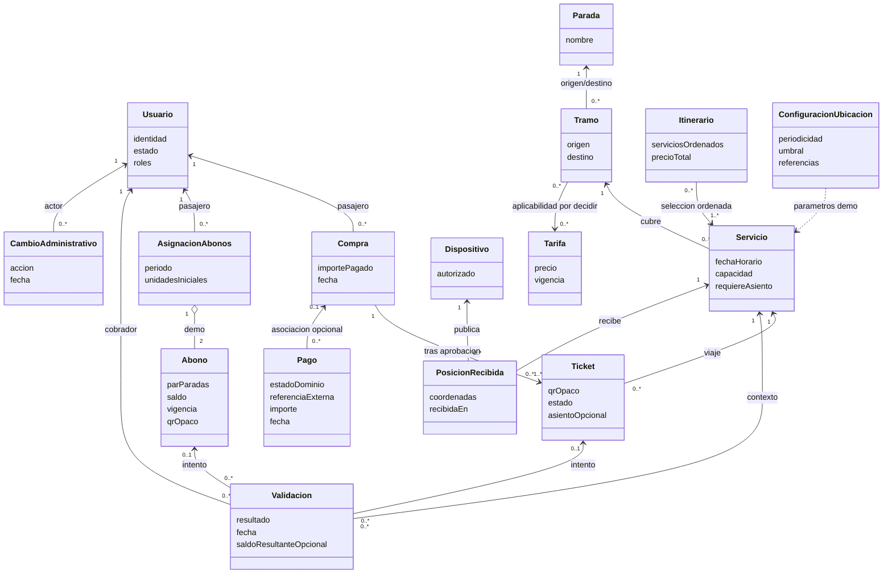
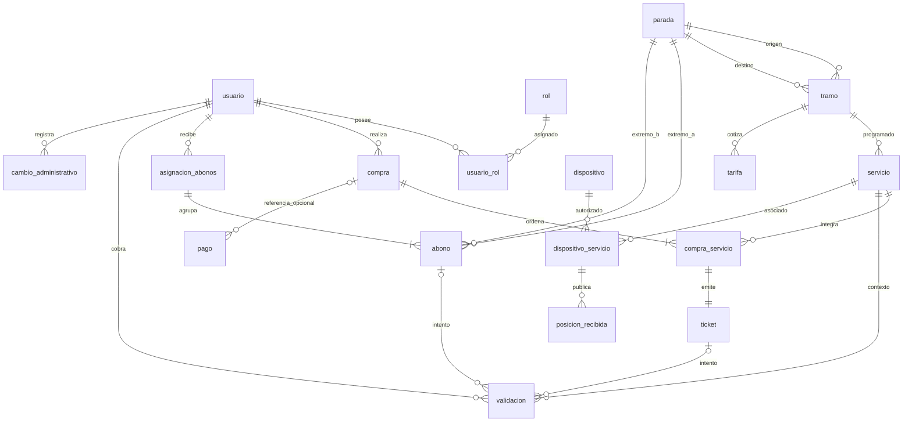

# Borrador de modelado de datos del MVP

**Estado: propuesta para revisión de Enzo, no esquema aprobado.** Primero se representan conceptos y reglas del dominio en UML; luego una posible persistencia MySQL en ER. Las cardinalidades y restricciones marcadas **propuesta** no autorizan por sí solas políticas comerciales. Fuentes: [MVP](../mvp.md), [requisitos](../requerimientos.md), [historias](../user-stories.md) y [backlog](../mvp-tasks.json). No se encontró consigna oficial; contrastar este borrador con ella antes de implementar.

## 1. Dominio (UML)

Un itinerario es una selección ordenada de servicios, no necesariamente una entidad durable. Un tramo representa el par de paradas de un segmento; el «orden dentro de una ruta» del inventario preliminar del MVP §8 es provisional: la pertenencia y el orden en una ruta requieren definición posterior. La instancia fechada que se valida es el servicio. El abono habilita un par de paradas en ambos sentidos (RN-13), no necesariamente una única dirección de servicio.

Las asociaciones del diagrama expresan intención, no multiplicidades aprobadas: un servicio puede aparecer en múltiples selecciones de itinerario; cada selección contiene uno o más servicios ordenados. Cada ticket emitido pertenece a exactamente una compra aprobada; la generación de todos los tickets ocurre junto con ella. Cada pago puede no referir compra emitida (rechazo); compra/pago puede requerir una referencia de intento independiente para representar rechazos y reintentos. Cada validación resuelta refiere **exactamente un** ticket o abono si el QR existe; un QR desconocido no refiere ninguno. Un ticket admite muchos intentos, pero a lo sumo uno exitoso.

## 2. Persistencia candidata (ER MySQL)

Los nombres y campos siguientes son **propuesta técnica**, no migración. `itinerario` se materializaría al comprar mediante `compra_servicio` (orden y precio congelado); la búsqueda puede construir itinerarios sin guardarlos. El ER representa únicamente compras ya aprobadas: cada `compra_servicio` tiene exactamente un ticket emitido. En el diagrama, las patas opcionales y las claves foráneas nulas de intentos se explican abajo.

`configuracion_ubicacion` es una configuración académica versionable por vigencia, no una fuente de posiciones; no se dibuja relación obligatoria con cada servicio hasta decidir el alcance de parámetros. Una publicación aceptada siempre conserva su asociación dispositivo/servicio y recepción; intentos rechazados no crean `posicion_recibida`.

### Diccionario y claves propuestas

| Tabla | Identidad y referencias propuestas | Integridad / nulabilidad propuesta |
| --- | --- | --- |
| `usuario`, `rol`, `usuario_rol` | PK `usuario_id`, `rol_id`; puente PK (`usuario_id`, `rol_id`) y dos FK | Identidad académica única; credencial segura fuera de este diseño; estado requerido. |
| `parada`, `tramo` | PK respectivas; tramo FK `origen_id`, `destino_id` | Ambos extremos NOT NULL y distintos; unicidad direccional del par por decidir con rutas. |
| `servicio` | PK `servicio_id`, FK `tramo_id` | Fecha/hora, capacidad positiva y `requiere_asiento` NOT NULL. Sin cupos inferidos de la venta hasta definir política. |
| `tarifa` | PK `tarifa_id`, FK `tramo_id` **provisional** | Importe no negativo, vigencia; aplicabilidad a tramo o servicio y solapamiento de vigencias pendientes. |
| `compra` | PK `compra_id`, FK `pasajero_id` | Fecha e importe total congelado no negativo; existencia final solo tras aprobación según flujo actual. |
| `compra_servicio` | PK `compra_servicio_id`, FK `compra_id`, `servicio_id` | `orden` positivo, UNIQUE (`compra_id`, `orden`); `precio_aplicado` no negativo congela importe por tramo. Conexión, suma y secuencia se verifican en API. |
| `pago` | PK `pago_id`, FK `compra_id` NULL **provisional**; FK `pasajero_id` propuesta | Importe, fecha, estado del dominio y referencia externa del proveedor cuando exista; vincular identidad externa y estado verificado, sin guardar credenciales ni números de tarjeta/CVV. Un rechazo puede no tener compra emitida; referencia de intento y cardinalidad de reintentos por decidir. |
| `ticket` | PK `ticket_id`, FK `compra_servicio_id`, FK pasajero derivable de compra | UNIQUE `qr_opaco`, UNIQUE `compra_servicio_id` (un ticket por tramo comprado), asiento NULL solo si el servicio no lo requiere; vencimiento/estado y asiento coherentes en API. |
| `asignacion_abonos`, `abono` | PK respectivas; asignación FK `pasajero_id`; abono FK `asignacion_id`, `extremo_a_id`, `extremo_b_id` | Vigencia, estado, unidades iniciales y saldo; `0 <= saldo <= iniciales`, extremos distintos, UNIQUE QR. Exactamente dos por asignación de demo, iguales unidades iniciales y saldos independientes: transacción API, no CHECK entre filas. |
| `validacion` | PK `validacion_id`; FK `cobrador_id`, `servicio_id`; FK `ticket_id` y `abono_id` NULL | Fecha, resultado requeridos; ambos FK NULL solo para código desconocido, nunca ambos presentes; código presentado opaco registrado con política de privacidad por definir, saldo resultante NULL salvo consumo de abono. Intentos fallidos no consumen. |
| `dispositivo`, `dispositivo_servicio`, `posicion_recibida` | PK respectivas; puente FK `dispositivo_id`, `servicio_id`; posición FK `dispositivo_servicio_id` | Autorización/asociación vigente verificada en API; latitud/longitud completas y dentro de rango, `recibida_en` NOT NULL. Conservar posiciones aceptadas sin prometer analítica; última = recepción más reciente del servicio. |
| `configuracion_ubicacion` | PK `configuracion_id` | Periodicidad y umbral positivos, referencias académicas configurables; cálculo no persistido como precisión garantizada. |
| `cambio_administrativo` | PK `cambio_id`, FK `actor_id` | Acción, objeto afectado y fecha requeridos para operaciones delimitadas en RF-007; no duplicar estados de negocio. |

**Alcance revisable de pagos:** la propuesta vigente usa la API de Mercado Pago con credenciales TEST y escenarios de prueba del proveedor, sin cobro real; la integración no está implementada. La API verifica el resultado del proveedor antes de emitir tickets, nunca confía en el éxito indicado solo por el cliente. Identificador externo y mapeo entre estado del proveedor y estado del dominio son cuestiones de diseño propuestas; producto de checkout, mecanismo de verificación y ciclo de reintentos quedan pendientes. Producción requiere otra decisión explícita.

**Restricciones candidatas:** PK/FK y UNIQUE para QR, orden e identidad impiden referencias rotas y duplicados directos; CHECK de cantidades, importes y coordenadas restringe filas individuales. Para un solo uso se puede añadir indicador de consumo único en ticket y unicidad parcial mediante estrategia compatible con MySQL, pero el índice concreto queda para implementación. Tras verificar la aprobación con el proveedor, la API debe ejecutar en transacción la creación de compra y emisión completa, asignación doble y validación con actualización condicional de estado o saldo y registro de intento; ante dos consumos simultáneos de ticket o última unidad solo uno confirma. FKs/CHECK por sí solos no verifican ruta conectada, pago aprobado, vigencia/autorización, asiento disponible por servicio ni igualdad entre dos filas. Las comprobaciones de asiento asignado automáticamente en Radial–Colonia son parte confirmada de la demo; unicidad/capacidad y política de reserva siguen sin definir.

## 3. Límites y trazabilidad

| Contrato | Cobertura del borrador | Fuente |
| --- | --- | --- |
| Identidad y configuración | Usuario/rol, paradas, tramos, servicio, tarifa, auditoría | RF-001/002/007; RN-12 |
| Itinerario y compra | Orden, precio congelado, pago aprobado/rechazado, ticket por servicio | RF-003/004; RN-01/02/05/06/07; CA-01/02/03 |
| Validación | QR opaco, intento desconocido o rechazado, ticket único, abono con saldo independiente | RF-005/006; RN-03/04/08/09/10/11/13; CA-04 a CA-09; RNF-002/003 |
| Ubicación | Posiciones recibidas aceptadas y parámetros para última posición/estimación | RF-008/009; RN-14/15; CA-11 a CA-14 |

El **dominio** expresa reglas y comportamiento; las tablas son una alternativa de almacenamiento y no contratos públicos. Los **DTO de API**, aún no definidos, deberán separar datos de compra, consulta y validación de las entidades persistidas: nunca exponer credenciales, precio mutable como precio pagado ni el estado completo dentro del QR. Para código inexistente, el DTO responde rechazo aunque `validacion` no tenga FK de recurso; una llamada sin autorización puede rechazarse antes de registrar un intento. Posiciones inválidas nunca reemplazan la última válida.

## 4. Decisiones abiertas para revisión humana

1. ¿Tarifa por tramo o por servicio y qué vigencia aplica al precio congelado? El FK de `tarifa` es provisional.
2. ¿Cómo se identifica el intento rechazado y se vinculan reintentos con compra eventual, identificador externo y estados del proveedor? La FK opcional `pago.compra_id`, cardinalidad y mapeo de estados son provisionales; también queda por elegir producto de checkout y modo de verificar el resultado sin confiar en el cliente.
3. ¿Existe ruta persistida con orden propio o alcanza el tramo entre paradas y la secuencia de servicios? No equiparar ruta y tramo sin consigna.
4. ¿Cómo se vincula cada abono bidireccional con servicios y tramos inversos al validar? RN-13 autoriza ambos sentidos, no define la representación de rutas.
5. ¿Se conservan todos los intentos de validación, incluido QR desconocido, y con qué política de retención del código presentado? La referencia exclusiva a ticket/abono y las respuestas de API deben acordarse juntas.
6. ¿Qué garantiza la unicidad de asiento por servicio y qué ocurre ante concurrencia/cupo lleno? La asignación automática de la demo ya está decidida, no su algoritmo ni la política de reserva.

Hasta resolver estas preguntas y obtener revisión cruzada, no derivar de este borrador migraciones ni contratos definitivos.
